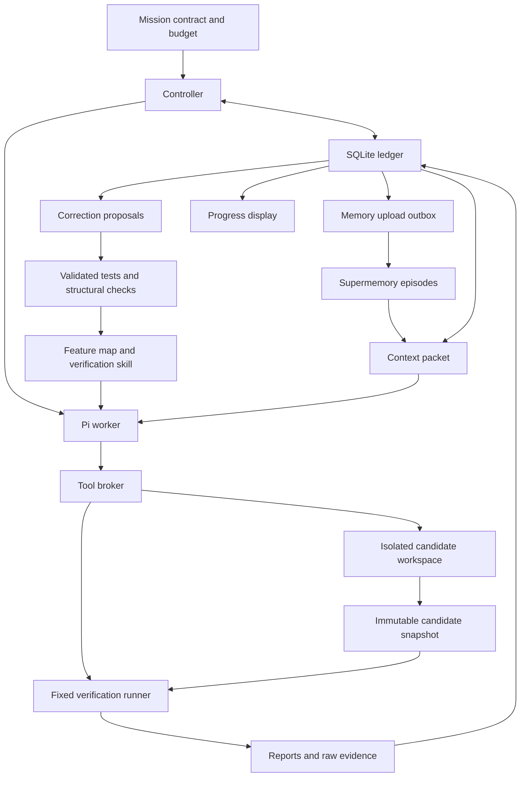

# Pi + Supermemory: a long-running agent that remembers, verifies, and improves

Updated September 26, 2026. Build window: 24 hours. Demo: coding and performance optimization. This revision replaces the earlier plan and incorporates the engineering principles in your supplied reconstruction of Lauren Tan's talk.

## 1. The decision

Build one reliable worker that can improve a small application, verify its own work through a standard runner, remember why earlier attempts failed, and continue after compaction or a process restart.

The system should learn in two ways:

1. Recall relevant experience from Supermemory when deciding what to try next.
2. Turn sufficiently supported corrections into durable engineering artifacts, such as regression tests, shared implementation paths, feature-map entries, and static checks.

The second behavior is the major addition to the original plan. A long-running agent should improve the environment that guides its future work. If every future worker has to rediscover a rule in a transcript, the system remains fragile.

Working name: **Horizon**. The name is optional. The product promise is concrete: give it a goal and a measurable acceptance condition; it keeps producing, checking, and learning from bounded experiments while preserving the mission.

The 24-hour result should be a functioning local harness and a defensible recorded demonstration. It does not need a production deployment, multiple agents, autonomous merging, or a new model training pipeline.

## 2. Source boundaries and what changes

The attached notes explicitly describe a reconstruction rather than an official transcript. This plan uses the principles as represented in those notes. It does not independently verify the talk's wording, employment details, PR count, or production outcomes.

Source: [your supplied talk reconstruction](</Users/blouse_man/.codex/attachments/3ab185dd-0eda-4aab-9702-a1a5b33b7b00/Pasted text.txt>).

| Principle in the notes | Change to our plan | Observable result |
| --- | --- | --- |
| Agents need reproducible ways to operate and verify the product | Build one `horizon verify` runner, then expose it as a Pi tool | The worker cannot substitute its own benchmark script for official measurements |
| Feature maps are materialized memory | Add a versioned map linking product behaviors, entry points, invariants, and scenarios | A fresh worker can locate and exercise a behavior without rediscovering the application |
| The codebase is the strongest memory | Supply one supported mutation path and one search contract | Future changes extend clear existing patterns |
| Corrections belong in the strongest useful enforcement layer | Add a correction workflow that proposes tests, structural fixes, or lint rules | A known error can be caught even when its prose lesson is absent from context |
| Bad examples propagate | Add a small, targeted pattern audit after accepted changes | Forbidden imports and bypassed mutation paths fail checks before becoming examples |
| Self-verification removes the human bottleneck | Require evidence before accepting a candidate | The worker can discover and repair a failed check without manual interpretation |
| Autonomy should follow evidence of reliability | Keep the initial action scope narrow and demonstrate recovery within it | Autonomous local iteration works without adding deployment or merge permissions |
| Skills themselves need evaluation | Test the verification skill on fixed task fixtures | Skill changes must preserve correct tool use and truthful completion reports |
| PR volume is an output, not a quality measure | Score correctness, valid optimization, recovery, repeated failures, and cost | Judges see useful outcomes rather than tool-call or patch counts |

Do not copy blanket bans on comments or React APIs. Those choices address a different codebase. Here, the equivalent correction is to prevent direct state mutation from bypassing the search index and cache invalidation path.

## 3. Scope and success criteria

### Required for the 24-hour build

- One Pi worker controlled by a TypeScript application.
- One isolated candidate workspace with a small TypeScript search service.
- One standard verification runner with machine-readable reports.
- One feature map with executable scenario references.
- SQLite records for mission state, experiments, checkpoints, lessons, and pending memory uploads.
- Supermemory ingestion and retrieval of experiment episodes.
- A bounded context packet refreshed at meaningful boundaries.
- Crash recovery and at least one execution-segment rotation.
- One demonstrated correction turned into an additive regression test or an executable architecture check.
- A terminal progress view and saved evidence bundle.

### Success has separate dimensions

| Dimension | Passing demonstration |
| --- | --- |
| Product correctness | The selected final artifact passes the fixed correctness suite and final holdout |
| Optimization | The selected artifact meets a frozen latency target or reports the measured shortfall honestly |
| Coherent memory | After rotation, the worker retrieves a relevant old result with its source and distinguishes it from a superseded fact |
| Durable execution | A killed controller resumes the same mission without losing its best artifact or double-accepting an experiment |
| Environment improvement | A known bug triggers a materialized check even without its natural-language memory in the worker context |
| Evidence integrity | Every accepted score identifies the exact code artifact, evaluator, workload, and run |

A proposed latency target is a 30% reduction in p95. Measure the seed implementation first, assess feasibility, and then freeze the target before the scored mission. Do not weaken it midway to claim success.

### Explicitly outside the first build

Multi-agent scheduling, production merges, a general-purpose autonomous rule generator, distributed execution, model fine-tuning, formal verification, self-hosted Supermemory, and a billion-token live run. Keep interfaces extensible, but do not implement these under the hackathon deadline.

## 4. The application the agent will improve

Use an in-memory document search HTTP service. A small product with real request paths is easier to verify than an arbitrary repository and more convincing than optimizing a function with a single timing loop.

### Fixed product contract

Each document has an `id`, `title`, `body`, and insertion sequence. Define the initial API precisely:

| Operation | Behavior |
| --- | --- |
| Insert | Add a unique document and make it searchable before the successful response returns |
| Update | Replace the searchable fields and invalidate results affected by the old or new content |
| Delete | Remove the document from future results |
| Search | Return matching IDs using the frozen matching and ordering rules |
| Health | Report readiness; it does not claim correctness |

For the initial contract, normalize text with Unicode NFC and lowercase it using a specified locale-independent JavaScript operation. Split normalized queries on whitespace. Every non-empty query term must occur as a substring of normalized `title + " " + body`. Return IDs in insertion order, then apply the requested limit. Define an empty query as returning no results. Updates preserve insertion sequence. Document these choices and test them before the mission begins.

This contract is deliberately simple. A token index that silently replaces substring semantics is incorrect even if it is faster.

Implement the reference model independently from the candidate. It must not import the candidate's normalization, matching, ordering, or mutation helpers to calculate expected results. Check the reference against a handful of hand-calculated examples before using it to grade generated scenarios.

### Seed architecture

- `domain/contracts.ts` defines public request/response types.
- `domain/normalize.ts` defines the supported normalization function.
- `storage/document-store.ts` owns documents and their mutation version.
- `search/search-engine.ts` implements the search contract.
- `application/document-service.ts` is the single mutation entry point and coordinates storage, indexing, and invalidation.
- `http/server.ts` adapts HTTP requests to application calls.

Start with a correct linear scan that repeatedly performs expensive normalization. It is slow enough to improve but easy to audit. Plausible optimizations include precomputed normalized text, bounded caches, and substring-compatible indexing. Do not plant an elaborate broken architecture just to force the demo narrative.

### Workloads

Use a fixed corpus large enough for service time to be measurable. Choose its size in the baseline stage, then freeze it. Include repeated queries, rare queries, mixed case, composed/decomposed Unicode, updates, deletes, and empty results.

Maintain development cases visible to the worker and a distinct final holdout with unseen document/query values and operation sequences. Both follow the same disclosed product contract. Holdout secrecy must not hide requirements the worker was never told.

If the agent never naturally makes the intended cache mistake, use a labeled fault-injection fixture to demonstrate that the harness detects it. Do not portray a seeded bug as a naturally occurring discovery.

## 5. Architecture and ownership



### Ownership table

| Component | Authoritative for | May propose | Must not control |
| --- | --- | --- | --- |
| Mission contract | Goal, budgets, fixed constraints, success rule | Nothing during a run | Measured outcomes |
| Controller | Scheduling, state transitions, acceptance decisions | Next task | Changing the frozen judge to rescue a candidate |
| Pi worker | Its reasoning and candidate edits | Hypotheses, patches, lessons, regression cases | Canonical scores, evaluator code, mission success flag |
| Verification runner | Measurements and fixed-check results | Diagnostic classifications | Product patches |
| SQLite ledger | Current mission state and evidence references | Nothing independently | Semantic truth without supporting evidence |
| Supermemory | Searchable experience and associations | Relevant historical context | Current goal, accepted artifact, permission changes |
| Feature map and code | Current supported engineering paths | New behavior entries after validation | Historical results for unrelated versions |

The worker and evaluator are different execution roles. They do not need to be separate LLM agents. Start with one model worker and deterministic evaluation code.

### Isolation decision

Keep the controller and Pi SDK on the host. Disable host built-in execution tools and expose a small broker-backed set of workspace and verification tools. Execute generated commands and candidate code inside a disposable container with only the candidate workspace mounted writable.

Use a separate runner process or container to drive the candidate service over a private local connection. The candidate must not share the runner's writable reports, hidden fixtures, credentials, or process namespace. The runner observes responses and elapsed time externally; it never accepts a JSON score printed by the candidate as evidence.

The broker owns container lifecycle. The model receives no Docker socket or arbitrary host shell. Its tool inputs identify a mission and artifact, not arbitrary host mount paths. Validate paths, resolve symlinks, and enforce workspace containment in the broker.

Pi's local documentation explicitly says isolation must cover tools that execute on the host too. Disabling the host shell while leaving another custom tool that executes arbitrary host code would defeat this design. See [the local isolation guide](/Users/blouse_man/Downloads/coding/github/mongomongo/pi/packages/coding-agent/docs/containerization.md).

Time-box this setup in the first two hours. If containers are unavailable, use an existing isolated execution environment. A same-user subprocess can support a cooperative prototype, but cannot honestly establish evaluator tamper resistance; record that reduced guarantee instead of claiming isolation.

## 6. Memory should exist in four forms

| Form | Contents | Retrieval method |
| --- | --- | --- |
| Materialized engineering knowledge | Supported code patterns, contracts, regression tests, static checks, feature map, verification skill | Read the relevant files and run checks |
| Exact mission state | Goal version, next task, budget, best artifact, active experiment, current policy version | Direct SQLite reads |
| Episodic experience | Hypothesis, change, result, failure condition, supported lesson, source references | Scoped Supermemory retrieval |
| Raw history and artifacts | Session segments, tool output, HTTP responses, profiles, code snapshots, reports | Evidence ID lookup and targeted file reads |

These stores have different responsibilities. Do not put all four into a vector index and hope similarity search returns the right answer.

When they disagree, resolve the question by type:

- The mission contract decides the requested behavior and target.
- A current source snapshot and its verified feature map describe the implementation.
- A runner report establishes a measurement only for the artifact and environment it identifies.
- An episode describes historical experience, which may not apply to the current version.
- A model-generated lesson remains a hypothesis until its supporting evidence and scope have been checked.

Never overwrite an old measurement with a new interpretation. Append a correction or supersession relation. For questions about current state, filter obsolete versions; for questions about past state, retain them.

## 7. Build a verification CLI before the autonomous loop

All commands below are proposed interfaces to implement. They are not existing commands in either repository.

```text
horizon doctor
horizon mission create --config mission.json
horizon verify --mission M --artifact A --suite smoke
horizon verify --mission M --artifact A --suite correctness
horizon verify --mission M --artifact A --suite performance
horizon profile --mission M --artifact A --scenario search-read-heavy
horizon features check --artifact A
horizon run --mission M
horizon resume --mission M
horizon inspect --mission M
horizon export --mission M
```

`doctor` checks the pinned runtime, execution environment, writable storage, provider access, and memory connection without printing credentials. It should distinguish configuration failure from product failure.

### Verification execution

1. Resolve the artifact ID to an immutable snapshot.
2. Verify its content hash and the frozen runner/config hashes.
3. Build it using the fixed toolchain and dependencies. Do not run a candidate-supplied install script on the host.
4. Launch a fresh candidate service inside the isolated environment.
5. Wait for health with a deadline.
6. Drive the named scenario using the fixed runner.
7. Save requests, observed responses, assertions, timing samples, and process exit details.
8. Stop the process, hash the artifacts, and emit one typed report.

The worker invokes a `verify_candidate` tool that delegates to this runner. It can inspect failures and retry its code. The controller independently checks the resulting report before acceptance. Do not duplicate the runner logic inside a skill or let each worker invent its own measurement procedure.

### Proposed report contract

```typescript
type VerificationReport = {
  schemaVersion: 1;
  reportId: string;
  missionId: string;
  experimentId: string;
  artifactHash: string;
  evaluatorHash: string;
  workloadHash: string;
  environmentHash: string;
  suite: "smoke" | "correctness" | "performance" | "holdout";
  status: "passed" | "failed" | "infra_error" | "timeout";
  assertions: { id: string; passed: boolean; evidenceId: string }[];
  metrics: {
    p95LatencyMs?: number;
    medianLatencyMs?: number;
    peakMemoryBytes?: number;
    measuredRequests?: number;
    failedRequests?: number;
  };
  evidenceIds: string[];
  startedAt: string;
  finishedAt: string;
};
```

The host records reports from the trusted runner channel and computes their hashes. Candidate-provided tool text with a matching JSON shape is not sufficient. A report without the expected artifact and evaluator hashes is invalid.

### Verification levels

1. Static and structural checks catch invalid imports, types, and bypassed architecture paths.
2. Contract tests check individual observable behaviors.
3. End-to-end scenarios use the service's real HTTP entry points.
4. Performance measurements compare valid artifacts under the same procedure.
5. Recovery tests verify the harness itself after interruption.

Formal proofs are a future option for a tightly specified component. A passing test suite is not a formal proof.

## 8. Materialized memory: feature map and verification skill

### Feature map contents

Put the map beside the verification skill, using a small JSON manifest as the source and readable Markdown as an optional rendering. Start with five entries, not a complete documentation generator.

```json
{
  "schemaVersion": 1,
  "featureId": "search-after-update",
  "description": "A completed document update changes subsequent search results",
  "entryPoint": "PATCH /documents/:id, then GET /search",
  "sourcePaths": [
    "application/document-service.ts",
    "storage/document-store.ts",
    "search/search-engine.ts"
  ],
  "invariantIds": ["INV-UPDATE-VISIBILITY", "INV-RESULT-ORDER"],
  "scenarioIds": ["update-removes-old-match", "update-adds-new-match"],
  "verificationSuite": "correctness",
  "knownTraps": ["Query-only cache keys can return pre-update results"],
  "verifiedArtifactHash": "populated-by-runner",
  "evidenceIds": ["populated-by-runner"]
}
```

The five initial entries cover matching/normalization, ordering/limits, insert visibility, update visibility, and delete visibility. Include an example request sequence and expected response in each scenario fixture.

### Map freshness

The map is valid only for the source version it identifies. `features check` verifies that paths and scenario IDs exist, then runs the named scenarios when their relevant files change. Deterministic identifiers and links can be regenerated automatically. Model-written descriptions are proposed edits until the corresponding behavior has been verified.

When the worker encounters stale map content, it should report the mismatch and inspect the implementation/contract. It must not assume that old navigation instructions or comments establish current behavior. After an accepted change, refresh affected entries and retain the previous map hash in history.

### Verification skill contract

Create `.pi/skills/verify-search/SKILL.md` in the controlled worker resource set. The skill should specify:

- How to identify the relevant feature and scenario.
- How to reproduce the observed failure through the standard tools.
- How to capture a baseline and profile when the failure concerns performance.
- How to make one bounded change along the supported architecture.
- How to invoke smoke checks, contract checks, and performance checks in order.
- How to report evidence IDs, unresolved failures, and uncertainty.
- How to stop on an infrastructure error instead of inventing a product explanation.

Keep implementation details in the runner. The skill teaches the procedure; the CLI executes it consistently.

### Evaluate the skill

Use four small fixtures with expected behavior:

| Fixture | Expected worker behavior |
| --- | --- |
| Slow but correct service | Run the supported baseline/profile commands and propose a targeted change |
| Stale results after update | Locate the mutation scenario, reproduce the mismatch, and cite its evidence |
| Candidate fails to start | Report startup failure; do not claim a latency improvement from zero requests |
| Verification tool unavailable | Report unverified work or retry within bounds; do not report success |

Score tool selection, required checks, correct interpretation, and evidence references. Prefer deterministic assertions over model grading. Reserve live-model runs for the behavior a scripted adapter cannot exercise. Pin skill and model versions in every result.

## 9. Turn corrections into stronger engineering artifacts

This implements the strongest practical point in the supplied notes. When a repeated failure appears, ask where that knowledge can live so a future agent encounters it automatically.

### Correction ladder for this project

| Preferred destination | Example | Why it helps |
| --- | --- | --- |
| Code structure | Centralize mutation and invalidation in `DocumentService` | Makes bypassing the correct path harder |
| Compiler/static checks and executable tests | Reject search-to-evaluator imports; test update visibility | Detects errors without recalling a paragraph |
| Explicit review or acceptance rule | Reject a performance report for a different artifact hash | Encodes a decision that spans components |
| Skill and feature map | Describe which scenario exposes stale caching | Teaches a repeatable diagnostic procedure |
| Prose guidance | Explain a nuance that cannot yet be checked mechanically | Useful supporting context, with limited enforcement |

Tests belong among executable checks even though not every semantic property can be enforced by lint. Avoid a brittle text rule such as banning every occurrence of `Map` because one cache was wrong.

### Lesson lifecycle

`observed -> reproduced -> proposed -> validated -> materialized`

A lesson may also become `rejected` or `superseded`. Record the evidence for every transition.

1. A runner failure identifies a concrete violated contract or a measured regression.
2. Reproduce the failure using the same artifact and scenario. An infrastructure error does not become a product lesson.
3. The worker proposes a narrowly scoped explanation and an enforcement artifact.
4. Validate the proposed check against a known failing fixture and a known valid fixture.
5. Confirm that its expected behavior comes from the frozen contract or independent oracle, not from the candidate's current output.
6. Run the existing fixed suite and check that the proposal does not weaken, skip, or replace it.
7. Materialize an eligible additive check and link it to the original episode.

For the MVP, automate only additive, schema-constrained regression scenarios under the existing runner. The worker proposes an operation sequence and invariant ID. The host derives expected results from the independent reference model and validates the sequence. This avoids executing arbitrary agent-written judge code.

Architecture and lint changes can be produced as reviewable proposals. Implement one predefined import-boundary check during setup. Do not attempt unrestricted automatic changes to lint configuration, harness source, or the scoring system in the first day.

### Concrete example

A cache keyed only by query text returns a deleted document. The runner records the exact request sequence and mismatch. The worker proposes a sequence containing insert, search, delete, and search. The host checks it against the reference model, verifies it fails on the stale-cache artifact and passes on the valid seed, and adds it to the learned regression suite.

The worker then fixes invalidation through the shared mutation path. That implementation becomes a better example for subsequent edits. Its feature-map entry links to the new scenario and the failure report. Supermemory retains the historical explanation with the code and workload versions.

Later, remove this prose lesson from a fresh worker's context and run the faulty artifact through verification. The learned regression should still fail. That is a direct demonstration of knowledge preserved in an executable artifact.

### Protect the measuring system

Keep two suites with separate identities:

- The fixed judge defines comparable correctness/performance scores throughout a benchmark condition.
- The learned regression suite is append-only, versioned, and checked in addition to the fixed judge.

New scenarios may strengthen local acceptance, but they cannot redefine the task or alter the fixed score. A newly discovered contradiction with the task contract requires a new explicit contract version and a new comparison run. No silent goalpost changes.

Report the learned suite version alongside each accepted artifact. Never describe all historical artifacts as passing checks added after they were measured unless they have actually been re-evaluated.

## 10. Data model and durable state

Use one SQLite database per mission for the MVP, with a single controller writer. Enable WAL and choose durability settings explicitly. Prefer `synchronous=FULL` for the mission ledger. Do not claim power-failure guarantees for external files unless their flush and rename behavior has also been implemented and tested.

| Record | Minimum fields |
| --- | --- |
| Mission | ID, objective/contract version and hash, status, target, best artifact, active task, budget limits, spent/reserved usage |
| Task | ID, mission ID, dependencies, status, hypothesis, completion criteria, next action |
| Experiment | ID, task ID, parent artifact, candidate artifact, strategy, hypothesis, lifecycle status, verdict, report IDs |
| Artifact | Hash, immutable path, parent hash, source manifest, creation time |
| Verification | Report ID/hash, artifact, evaluator/workload/environment hashes, measurements, verdict |
| Episode | ID, experiment, observations, interpretation status, evidence IDs, applicable versions, supersedes link |
| Lesson | ID, source episodes, invariant, proposed correction, state, positive/negative validation evidence |
| Checkpoint | ID, sequence number, mission/task state, active operation, last finalized event, session segment, best artifact |
| Outbox | Idempotency key, episode ID, payload hash, remote document ID, delivery/processing state, retries, next attempt |
| Segment | Mission ID, ordinal, Pi session path/ID, checkpoint link, time range, event range, archive hash |
| Event | Monotonic sequence, event key, timestamp, type, entity ID, payload/evidence reference |

Use unique constraints on event keys, experiment-result identities, and outbox idempotency keys. A repeated event must be harmless. Do not rely on the model to invent unique database identifiers.

### Persistence ordering

1. Persist experiment intent and parent artifact before allowing edits.
2. Persist finalized tool events as they arrive, not only at `agent_settled`.
3. Snapshot completed candidate files into a temporary directory.
4. Finish hashing and atomically publish the snapshot before referring to it as complete.
5. Start verification with a persisted operation ID.
6. Save the finished report and evidence files before committing their references.
7. In one transaction, record the result, update the best pointer if eligible, create a checkpoint, and enqueue the memory episode.

If the process dies after files are written but before the transaction, they are orphan artifacts to reconcile. If it dies before a file is finalized, that file is not an accepted artifact. The recovery path must make this distinction.

Restore rejected experiments only inside the disposable candidate workspace. The controller, source repositories, and user's unrelated files are never rollback targets.

## 11. Supermemory integration

Use the hosted SDK for the hackathon. Inspect installed types and pin a tested version rather than combining snippets from different releases. The local repository and current [quickstart](https://supermemory.ai/docs/quickstart) describe scoped ingestion/search and asynchronous processing.

### Ingestion unit

Use one bounded experiment episode with enough surrounding context to explain the result:

```text
Mission and objective version
Task and hypothesis
Relevant feature and invariant IDs
Parent artifact and candidate artifact
What changed
Observed correctness and performance results
Failure condition or accepted improvement
What remains uncertain
Source report IDs and artifact references
Suggested next action
```

Use a mission-specific `containerTag` and stable episode `customId`. Reuse the same custom ID for retries of identical content. Give a corrected episode a new explicit version and supersession link rather than racing two different payloads under one identity.

Store exact raw evidence locally. Put bounded observations and source pointers in Supermemory. Do not ask Supermemory to be the transaction log, job queue, or metric database.

### Outbox behavior

Separate `pending`, `submitted`, `document_ready`, `memory_ready`, and `failed` where the API permits observing those states. Save remote IDs and timestamps. API acceptance is not search readiness. Default extraction may lag document indexing, so verify the actual retrieval path needed by the demo. If readiness cannot be established, keep the episode available in the local recent-results cache and record the uncertainty.

Use exponential backoff with a maximum delay and request timeout. Do not block a checkpoint waiting for a remote service. During a memory outage, the mission can continue from canonical state and a bounded recent history, with degraded retrieval clearly recorded.

### Retrieval policy

At the start of a cycle, compose a query from the active feature, hypothesis, invariant IDs, and relevant errors. Request a small candidate set, for example 8 to 12 episodes, then select about 3 to 5 within the token budget.

Post-filter returned results by mission scope, evidence availability, artifact applicability, and supersession state. Prioritize directly relevant verified failures and measurements over broad model interpretations. Preserve useful old results even if they are not recent; freshness alone should not erase a durable constraint.

The worker may call `recall_history` for a targeted query and `read_evidence` for bounded source material. Record what was retrieved, what was actually injected, and which episode IDs the worker cites when choosing a hypothesis. Citation is a trace of use, not proof that retrieval caused an improvement.

Cross-mission memory is disabled in the MVP. Later, only explicitly generalized lessons should enter a project-wide pool.

## 12. Context management and Pi integration

The checked-out Pi commit is `2b0a123de`; its coding-agent package declares version `0.87.1`. Supermemory is at `cfa6c7cb`. These remain source findings, not proof that the integration runs.

Use the public SDK and extension contracts. Start from the checked-in [extension example](/Users/blouse_man/Downloads/coding/github/mongomongo/pi/packages/coding-agent/examples/sdk/06-extensions.ts) and [session example](/Users/blouse_man/Downloads/coding/github/mongomongo/pi/packages/coding-agent/examples/sdk/11-sessions.ts). Current documentation confirms the session and lifecycle interfaces: [Pi SDK](https://pi.dev/docs/latest/sdk), [extensions](https://pi.dev/docs/latest/extensions).

| Interface | Integration behavior |
| --- | --- |
| `createAgentSession` | Construct the worker with explicit model, mission workspace, controlled resources, and persistent session manager |
| `noTools: "builtin"` and custom tools | Remove host built-ins and expose broker-backed workspace, verification, and memory tools |
| `DefaultResourceLoader` or controlled resource loader | Load only the intended skill and extension set; do not execute arbitrary workspace extensions |
| `SessionManager.create/open` | Create or reopen the exact persisted segment, never simply choose the most recent unrelated session |
| `context` | Add one request-local packet assembled from current state and cached retrieval |
| `tool_result` / `message_end` | Persist finalized outcomes with stable identities and bounded output |
| `session_before_compact` | Commit a checkpoint and local outbox entries; do not require a successful remote upload |
| `session_compact` | Record compaction and rebuild the packet from authoritative fields |
| `agent_settled` or completed `session.prompt()` | Recognize the completed cycle after Pi's own retries and continuations |
| `session.abort()` | Stop a cycle on deadline or budget exhaustion; the broker also terminates child processes |

In this Pi revision, `agent_end` alone is insufficient because automatic recovery or queued work can follow. When replacing sessions, rebind listeners and extensions to the new instance. Do not mutate the agent's in-memory message array as a substitute for persisted session state.

### Proposed tools

- `workspace_read`, `workspace_search`, and `workspace_edit` operate inside the candidate boundary.
- `workspace_exec` runs commands only in the isolated candidate environment with a timeout and bounded output.
- `verify_candidate` calls the fixed runner on a snapshot.
- `profile_candidate` invokes a known profiling recipe and returns evidence references.
- `recall_history` searches scoped episodes.
- `read_evidence` reads known evidence IDs through a bounded host lookup.
- `propose_regression` submits a declarative operation sequence and invariant ID.

Only the controller writes canonical experiment verdicts, accepted-artifact pointers, and mission status. Host tools accept structured IDs and validated parameters, not executable snippets received from memory.

### Packet budget

Start with an 8,000-token maximum packet, separate from recent conversation and tool context:

| Portion | Initial allowance |
| --- | --- |
| Frozen goal, constraints, current state, budgets | 1,500 |
| Relevant feature map and verification instructions | 1,500 |
| Recent results and current hypothesis | 1,500 |
| Retrieved episodes | 2,500 |
| Evidence pointers and immediate next action | 1,000 |

Treat these as tunable allocations. The total model request must also fit the selected model's context limit and output reserve. Never truncate required constraints to make room for extra retrieval. If pinned state cannot fit, stop packet construction with a configuration error.

Refresh retrieval at cycle boundaries and after major failures, not on every streamed token. Replace the request-local packet rather than appending a fresh permanent copy each time. Keep complete tool-call/result pairs when trimming conversational material. Store long logs as files and return short excerpts plus evidence IDs.

## 13. Controller state machine and experiment policy

Mission states are `ready`, `running`, `waiting`, `blocked`, `succeeded`, `budget_exhausted`, and `failed`. Experiment states are `planned`, `editing`, `snapshot_ready`, `evaluating`, `accepted`, `rejected`, `inconclusive`, and `interrupted`.

A failed candidate normally rejects an experiment; it does not fail the mission. A malformed configuration can fail the mission. A missing external dependency can block it. An API rate limit can put it into a persisted waiting state with a next retry time.

```text
recover or initialize mission
verify frozen contract, evaluator, and environment identities
while mission can run:
    reconcile active operation and reserve a cycle budget
    choose an unmet task or a new hypothesis
    load current feature map and relevant experience
    persist experiment intent
    run one Pi work cycle with bounded tools and time
    snapshot candidate
    run static checks, correctness, learned regressions, then performance
    validate runner reports and classify the outcome
    accept an eligible artifact or preserve the existing best
    record a scoped episode and any correction proposal
    checkpoint and enqueue memory delivery
    update next action from the evidence
    compact or rotate when the configured threshold is reached
run final holdout on the chosen artifact
export the outcome, including any unmet requirements
```

### Task selection

Start with a small explicit task graph: baseline, characterize hotspots, optimize one hotspot, verify correctness, verify performance, final validation. The model can propose substeps, but each must have an observable completion condition.

Before editing, require a hypothesis containing the expected mechanism, affected feature, anticipated metric change, and likely correctness risk. For example: precomputing normalized document text should reduce repeated normalization work without changing substring semantics.

Choose one change per experiment when possible. Allow necessary supporting edits, but reject a bundle of unrelated optimizations as hard to diagnose. A valid neutral refactor can enter an exploration branch if it enables a named next experiment. It does not replace the best measured artifact until the acceptance policy permits it.

### Stagnation handling

After three completed experiments without a valid improvement, require a new mechanism or a profiling step. Detect repeated attempts using normalized strategy, affected feature, failure signature, and artifact lineage. Do not ban an entire strategy after one failure; a corrected invalidation design may make a previously failed cache useful.

Cap the number of exploration steps and keep their artifacts separate from the best pointer. This supports a necessary intermediate change without quietly accepting a performance regression as the new baseline.

### Budget handling

Persist maximum wall time, model input/output tokens, estimated spend if pricing is configured, tool timeouts, experiment count, and memory-service operations. Check deadlines during tool execution and between model turns, not just after a long cycle finishes.

Reserve enough budget for final verification before starting another experiment. Count worker, compaction, and lesson-generation model calls. Track Supermemory charges separately if only operation counts are available. If a provider omits exact usage after a crash, retain an estimate and flag it as uncertain rather than resetting usage to zero.

A model response saying “done” does not change mission status. Only the controller can mark success after the required runner evidence passes.

## 14. Measure optimization without rewarding noise or broken behavior

Freeze the following in `mission.json`: seed artifact, product contract, evaluator hash, corpus/workload seeds, machine/runtime identity, concurrency, warmup, measured request count, repeated-run count, memory limit, target, and tolerance procedure.

Start with five baseline repetitions and five candidate repetitions using the same scenario schedule. Use an interleaved baseline/candidate order to reduce drift. Run only one performance job at a time. Verify request counts and failures so a crashed or short-circuited server cannot look fast.

For each repetition, compute p95 from all measured requests after warmup. Preserve the raw samples. Compare the median of the repeated p95 values; do not call this the pooled p95. Include median latency and per-scenario correctness beside the primary metric.

During baseline setup, estimate variation between repeated runs. Freeze an improvement margin that exceeds observed noise, with an initial floor such as 5%. If noise is too large to distinguish useful changes, repair the workload or environment before optimization. These are demo heuristics, not a statistical significance claim.

Accept a candidate only if:

1. The fixed correctness suite passes.
2. All applicable learned regressions pass.
3. Resource usage stays within the frozen limit.
4. The candidate beats the current best by the frozen margin on the selected repeated-run statistic.
5. At least four of the five paired repetitions improve, or an explicitly chosen alternative stability rule passes.
6. Every report matches the exact candidate and frozen evaluator/workload identities.

A candidate that is valid but has ambiguous timing is `inconclusive`, not a new best. Keep it available for a bounded rerun. A candidate that is faster but incorrect is `rejected` and has no eligible speed score.

Measure peak memory externally using the same execution environment for baseline and candidate. Specify whether the recorded value is container memory or process RSS. Do not compare unlike units or switch definitions midway.

Final success additionally requires the frozen target against the original baseline and one holdout verification. Keep the holdout from becoming another iterative training workload. If it fails, record failure honestly; do not repeatedly tune against the same hidden cases and still describe them as unseen validation.

## 15. Recovery, compaction, and continuous missions

### Recovery procedure

On startup, acquire a single-controller lock. Load the latest complete checkpoint and reconcile any later durable events. Confirm the contract, runner, and source identities. Inspect the active operation before deciding to rerun it.

| Interruption point | Recovery behavior |
| --- | --- |
| During candidate edits | Mark the unfinished experiment interrupted; inspect/snapshot its workspace before deciding whether to continue or restore its parent |
| After snapshot creation | Reuse the immutable snapshot if its manifest verifies |
| During evaluation | Look for a finalized matching report; otherwise terminate orphan work and rerun that artifact under a new attempt ID |
| After report write, before database commit | Validate the report and finish the idempotent transaction |
| After acceptance, before memory upload | Preserve the accepted artifact; drain the outbox using the stable episode ID |
| During compaction | Recover from durable mission state and the last valid Pi segment, without treating a partial summary as authority |
| During segment rotation | Select the last committed active segment; finish or discard the uncommitted replacement |

A timeout must terminate candidate child processes as well as stop the model. Add deadlines to network tools and the evaluator. For delayed retries, store `nextWakeAt`; a process supervisor can relaunch the controller and honor that value.

The MVP guarantees recovery only for its implemented local operations. Durable transcripts do not make arbitrary external side effects exactly once. Adding deployment, payments, or message delivery later would require operation-specific idempotency and reconciliation.

### Segment rotation

Compaction reduces what the model sees but does not remove the need to manage growing persisted history. Keep a stable mission ID while creating bounded Pi execution segments.

At an idle boundary:

1. Persist the goal, active task, best artifact, current evidence references, pending work, and usage totals.
2. Close and archive the current segment with its event range and hash.
3. Create a new persistent Pi session using the current controlled resources.
4. Build a fresh packet from mission state, feature map, recent results, and retrieved episodes.
5. Commit the new segment as active, then resume the task.

For testing, trigger rotation after a small fixed number of cycles, such as three. Production thresholds should also consider serialized segment size and startup cost. Never rotate in the middle of an unresolved tool call without a reconciliation policy.

The user sees one mission; the worker sees successive bounded contexts. Preserve event and artifact links across segments so “why did we do this?” remains answerable.

## 16. What the billion-token claim requires

Define the term with the organizers if possible. A continuous logical mission across execution segments is feasible to design; a single unbounded in-memory Pi transcript is a different requirement.

Track three quantities separately:

- Unique history tokens stored, counted with a named tokenizer and deduplication rule.
- Cumulative model tokens billed or estimated across all calls.
- Maximum model-request context and retrieval packet size.

Repeatedly sending the same 50,000-token context does not create 50,000 new remembered facts each time. An archive capable of holding a billion tokens also does not prove the agent can retrieve the right evidence or maintain coherent decisions over it.

### Intended scaling path

Keep raw event segments compressed with stable IDs, hashes, time ranges, and offsets. Use SQLite for a local indexed manifest in the MVP. Later move raw artifacts to object storage and coordination state to a server database if required. Index bounded episodes and milestone summaries in Supermemory, retaining links to raw evidence.

Every summary must carry its source range, generation version, and supersession links. Important goal constraints remain exact ledger fields. Prefer re-deriving a summary from source episodes over indefinitely summarizing earlier summaries, which compounds errors.

At larger scale, retrieval should first select relevant tasks/milestones and then fetch the needed episodes and raw evidence. Bound the number of candidates and tokens at each stage. Measure latency and answer accuracy rather than assuming indexing capacity implies useful memory.

### Scale experiment after the MVP

Build a labeled archive with interleaved tasks, distractors, changing facts, exact constraints, and linked evidence. Test several increasing sizes. Ask questions requiring old facts, latest values, cross-episode links, and correctly abstaining when evidence is absent.

Report recall at a fixed result count, answer correctness, stale-fact errors, source-link validity, p95 retrieval latency, indexing lag, cost, and context size. Include questions where lexical overlap is misleading. Label generated history as synthetic.

The hackathon should report the largest history and longest runtime actually tested. A small replay test demonstrates the measurement method, not a billion-token result. Supermemory service capacity, ingestion cost, and quality at that scale remain empirical questions.

## 17. Evaluation that separates the useful parts

### Mission comparison

Use the same seed application, model, model settings, fixed runner, feature map, budget, and interruption schedule across these conditions:

| Condition | Durable controller | Supermemory history | Automatically materialized regressions |
| --- | --- | --- | --- |
| A: base controller | Yes | No | No |
| B: memory | Yes | Yes | No |
| C: memory and corrections | Yes | Yes | Yes |

All conditions get the same initial engineering environment. This avoids claiming a memory benefit when one condition simply received a better feature map or more reliable runner. An ordinary Pi baseline is optional and must be labeled as a broader system comparison with different capabilities.

Use separate memory scopes and fresh workspaces for each condition and seed. Predeclare how much local recent history A receives, and hold it fixed. B and C must not inherit memories created by another condition. Count all retrieval and correction costs against the relevant budget.

If time permits, run three seeds per condition. If not, prioritize a complete C run and small, clearly labeled exploratory comparisons. Do not present one lucky run as a robust average effect.

### Metrics

- Final fixed-suite and holdout correctness.
- Improvement against the original baseline, and whether the target was reached.
- Number of invalid candidates and repeated failure signatures.
- Number of validated corrections and whether they catch their negative fixtures.
- Recovery success and time to the next useful action.
- Retrieval relevance and source correctness on a small labeled probe set.
- Number of manual interventions required.
- Model usage, remote memory operations, wall time, and evaluation time.

### Targeted reliability cases

| Case | Required observation |
| --- | --- |
| Old constraint after rotation | Correct constraint recovered from exact state or cited source |
| Superseded historical statement | Current answer uses the newer applicable version and can explain the old value when asked |
| Wrong mission search result | Filtered out before context injection |
| Missing source artifact | Lesson marked unsupported; no fabricated evidence path |
| Duplicate finalized event | One logical result and one outbox episode |
| Remote memory unavailable | Checkpoints continue; retrieval degradation is visible; outbox later drains |
| Long tool output | Raw log preserved, bounded excerpt injected |
| Candidate tries to change judge files | Execution boundary denies the write |
| Candidate report has wrong artifact hash | Controller rejects it |
| Crash after acceptance before upload | Same best artifact after restart and no duplicate acceptance |
| Failed regression proposal | Rejected if it passes the negative fixture or rejects the valid reference behavior |
| Known bad artifact without prose lesson | Materialized check still catches it |

Test database/recovery and report validation with deterministic adapters and synthetic events. Use actual provider calls only for the integration and skill behaviors that require the model. These tests protect real failure boundaries; avoid tests that merely repeat field assignments.

## 18. Repository layout and module responsibilities

Create `horizon/` beside `pi/` and `supermemory/`. Keep the upstream clones as references; do not spend the hackathon maintaining a fork.

```text
mongomongo/
  HACKATHON_PLAN.md
  pi/
  supermemory/
  horizon/
    package.json
    mission.example.json
    src/
      cli.ts
      controller.ts
      mission-contract.ts
      ledger.ts
      recovery.ts
      artifact-store.ts
      pi-worker.ts
      tool-broker.ts
      context-packet.ts
      memory-adapter.ts
      memory-outbox.ts
      lesson-policy.ts
      progress.ts
    verification/
      runner.ts
      reference-model.ts
      reports.ts
      scenarios/
      workloads/
      fixtures/
    resources/
      features.json
      skills/verify-search/SKILL.md
      extensions/memory.ts
    demo/
      search-service/
    test/
      recovery.test.ts
      report-validation.test.ts
      memory-scope.test.ts
      lesson-policy.test.ts
      context-budget.test.ts
    runs/
      <mission-id>/
        state.sqlite
        manifest.json
        candidate/
        artifacts/
        reports/
        evidence/
        sessions/
        exports/
```

The resource loader maps the controlled skill into Pi's runtime. Directory placement alone does not guarantee discovery; verify it in the integration smoke test.

Keep `controller.ts` responsible for orchestration, with runner reports as inputs. `ledger.ts` owns transactional writes. `memory-adapter.ts` isolates external API changes. `lesson-policy.ts` validates the narrow declarative proposal format. `tool-broker.ts` is the only place that launches candidate processes or maps host paths into their environment.

Store credentials outside artifacts and transcripts. Ignore `runs/`, local secrets, and generated dependencies in the project repository. The evidence export includes redacted configuration and reproducible hashes, not API keys or unrelated host settings.

## 19. A 24-hour implementation schedule

This is a sequence for one builder. “Worker” refers to the agent being built; the schedule does not depend on parallel developer agents. Time estimates are targets, and the cut rules below take precedence over polishing every section of this design.

| Hours | Work | Concrete exit condition |
| --- | --- | --- |
| 0 to 2 | Check SDK/package compatibility, provider and memory access, container runtime; fix the product contract and baseline procedure | One Pi request, one memory round trip, and an isolated candidate service work; exact versions recorded |
| 2 to 5 | Implement seed service, independent reference model, HTTP verification runner, report schema, and five feature entries | Known correct seed passes; a known stale-cache fixture fails; baseline repeats are stored |
| 5 to 8 | Implement ledger, artifacts, broker tools, Pi cycle, and controller acceptance | Two bounded experiments run; only trusted matching reports can update the best artifact |
| 8 to 11 | Implement episode outbox, retrieval filtering, source reads, packet budget, and verification skill | Old evidence is retrieved by ID after a fresh worker start; wrong-scope content is rejected |
| 11 to 14 | Implement checkpoint/recovery, process termination, usage persistence, and segment rotation | Kill during an experiment and after report creation; both restart correctly |
| 14 to 16 | Implement one declarative regression proposal path and predefined import check | Negative fixture fails, positive fixture passes, learned test remains separate from fixed judge |
| 16 to 19 | Run the full mission, reliability cases, and selected comparisons | A saved run contains complete lineage, recovery evidence, and honest optimization results |
| 19 to 21 | Repair observed defects, simplify rough edges, finalize export and terminal view | Rehearsal can run from clean mission state using one command |
| 21 to 24 | Freeze features, record demo, prepare measured results and explanation | Evidence bundle, working demo, and a short presentation are ready |

### Minimum slice at hour 8

A worker edits a candidate through the broker, the fixed runner measures that immutable snapshot, and the controller records a verdict and preserves the best artifact. If this is missing, pause all UI, profiling extras, and dynamic lesson work.

### Cut rules

- If setup exceeds two hours, simplify the demo and use known installed runtime components. Do not start self-hosting Supermemory.
- If behind at hour 11, keep one retrieval query and simple deduplication. Drop profiles and sophisticated ranking.
- If behind at hour 14, retain restart recovery and one segment rollover. Defer general delayed-job scheduling and multi-level summaries.
- If behind at hour 16, demonstrate correction materialization through the single predesigned regression schema. Defer automatic lint proposals and broad code gardening.
- If behind at hour 19, run fewer comparison seeds and label uncertainty. Keep a complete end-to-end trace and the required reliability checks.
- Never cut the independent evaluator, exact artifact identity, durable mission state, or evidence-linked memory. Those define the project.

The project can still be credible if it misses the optimization target. It is much less credible if it claims progress from an unverified score or pretends a restart created a continuous mission when state was manually reconstructed.

## 20. Demo and submission package

### What to show on screen

Use a terminal view or simple local page with:

- Mission goal, constraints, and remaining budget.
- Current task, hypothesis, and active worker segment.
- Best eligible latency and correctness status.
- A chronological experiment list with accepted/rejected/inconclusive outcomes.
- Retrieved episode IDs and source links for the current decision.
- Newly materialized regression checks and their evidence.
- Last checkpoint, recovery events, and remote-memory processing status.

Mark seeded fixtures and replayed events explicitly. A replay is useful for a short presentation, but it must remain distinguishable from a live run.

### Five-minute presentation sequence

1. Show the frozen goal, seed artifact, and baseline measurements.
2. Show a faster candidate rejected for stale search results, with the exact request/response evidence.
3. Show the remembered episode and the new regression scenario derived from the fixed contract.
4. Force a segment rotation and kill/restart the controller. Show that mission ID, budgets, best artifact, and pending work survived.
5. Remove the natural-language lesson from a targeted probe and show that the learned regression still catches the bad artifact.
6. Show a valid later candidate, the actual final metric, and holdout status. If the target is unmet, say so.

The important claim is that a failure produces both retrievable experience and a stronger engineering environment, while the mission stays intact across interruption.

### Exported evidence

Create a bundle containing the frozen mission contract, dependency/runtime identities, seed/final artifact hashes, experiment table, fixed and learned suite versions, raw timing samples, correctness reports, checkpoint/recovery trace, retrieval probe results, and usage totals. Include a short reproduction README with the implemented CLI commands.

Label architectural aspirations separately: a billion-token archive, weeks-long operation, distributed recovery, and broader automatic codebase improvements require future tests. Do not use the reported scale of someone else's system as evidence for this one.

## 21. Definition of done

The hackathon build is complete when a clean mission can run through verified experiments, preserve its best valid artifact, retrieve a relevant past episode after restart, and demonstrate one correction that survives as an executable check. The exported results must identify what was measured and what remains unproven.

The first implementation task is the verification runner and its two fixtures: a correct seed and an observably wrong cache. That establishes the measurement system everything else depends on.

## 22. Reference status

Read for this revision:

- The user-provided reconstructed talk notes, used for principles rather than verified quotations.
- Local Pi SDK examples, extension types, SDK factory options, compaction documentation, and isolation documentation at commit `2b0a123de`.
- Local Supermemory quickstart and the current official API quickstart at commit `cfa6c7cb` for the checked-out repository.
- Current official [Pi SDK](https://pi.dev/docs/latest/sdk), [Pi extensions](https://pi.dev/docs/latest/extensions), and [Supermemory quickstart](https://supermemory.ai/docs/quickstart) pages.

All `horizon` commands, schemas, thresholds, layouts, and workflows in this document are proposed implementation decisions. This update creates the plan only. No agent runtime, benchmark, or memory integration has been implemented or tested by writing this document.
