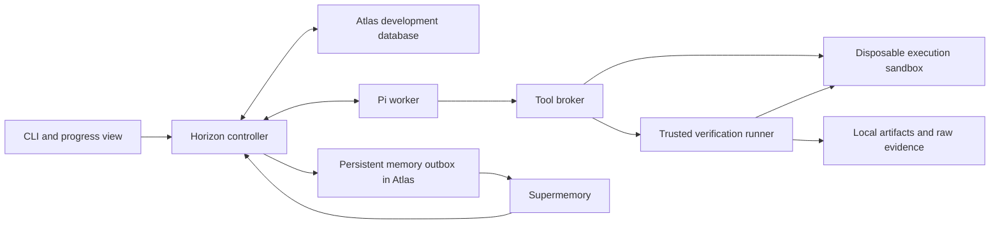

# Horizon: Atlas development cluster and sandboxed execution

Status: implementation plan. September 26, 2026.

## Goal and scope

Extend the existing `horizon/` application so one Pi agent can improve the demo search service, verify its changes, remember earlier experiments, and resume after interruption. Use MongoDB Atlas as the development/test database for agent state and a separate execution sandbox for generated code.

The confirmed meaning of "MongoDB Atlas sandbox" is an Atlas development/test cluster plus sandboxed code execution. These are separate components. Atlas stores records; the execution sandbox runs code.

This plan updates the storage and isolation decisions in `HACKATHON_PLAN.md`. Keep its existing search contract, independent verifier, bounded experiments, and evidence requirements. The proposed default is local Docker isolation for the hackathon, extending the implementation already present. A hosted sandbox can replace that backend later.

## Starting point

Repository inspection shows:

- `horizon/src/ledger.ts` implements synchronous SQLite persistence, transactions, and FTS5 episode search.
- `horizon/src/controller.ts` coordinates experiments, checkpoints, verification, and memory uploads.
- `horizon/src/memory-adapter.ts` supports Supermemory and a local adapter.
- `horizon/verification/candidate-process.ts` supports Docker and subprocess execution. Docker already applies several resource and filesystem restrictions.
- `horizon/src/tool-broker.ts` launches commands on the host. An executable allowlist that permits `node` does not isolate generated code.
- `horizon/mission.example.json` selects subprocess isolation and a scripted worker.

These are code observations, not fresh runtime results. This task creates the plan only.

## Target architecture

The controller owns state transitions and acceptance decisions. The worker proposes edits and experiments. The verifier measures behavior through the candidate's HTTP interface and produces reports tied to exact artifact hashes.

Atlas becomes authoritative for new Atlas-backed missions. Keep SQLite available for existing local missions and fast tests, with one selected backend per mission. Do not dual-write canonical state or silently switch backends during an outage.

Keep Supermemory for semantic retrieval. Keep immutable code snapshots, transcripts, and large raw evidence files on the controller's disk for this single-host MVP; store their hashes and references in Atlas. Recovery on another machine requires transferring those files and is outside the first demo.

## 1. Configure the Atlas development environment

- Create a dedicated development project/cluster and database named `horizon_dev`, with separate database names for integration test runs.
- Choose the cluster tier during setup based on available credits, region, and required capabilities. This plan does not assume a price or entitlement.
- Create a controller database user scoped to the application database. Keep Atlas administration credentials separate.
- Allow the controller's outbound IP through the Atlas IP access list. Use the driver's TLS connection and keep its URI in `MONGODB_URI`; use `MONGODB_DB` for the database name.
- Add a redacted `.env.example` and extend `doctor` to check connectivity, required indexes, and transaction support without printing credentials.
- Keep MongoDB, model, and Supermemory credentials out of sandbox environments, artifacts, and logs.

Atlas requires database credentials and permitted network access. Follow the official [connection guide](https://www.mongodb.com/docs/atlas/driver-connection/) and [database-user configuration](https://www.mongodb.com/docs/atlas/security-add-mongodb-users/).

Done when the controller can connect, write and read a disposable record, run a transaction probe, and remove its own probe data.

## 2. Add an Atlas ledger

Introduce an asynchronous ledger interface and implement SQLite and MongoDB adapters behind it. Update controller, recovery, context assembly, progress, and memory-outbox callers to await persistence. Inventory direct SQL access before changing the interface; replacing the constructor alone will not migrate the application.

Use the official MongoDB Node.js driver, pinned to a compatible version during implementation. Map the existing records into collections:

| Collections | Contents and required constraints |
| --- | --- |
| `missions` | Frozen contract, budgets, best artifact, status, controller lease, revision |
| `tasks`, `experiments` | Ordered work, hypotheses, attempts, candidate hashes, outcomes |
| `artifacts`, `verifications` | Content hashes, file references, measurements, evaluator identity |
| `episodes`, `lessons`, `learnedScenarios` | Source-linked experience and validated corrections |
| `checkpoints`, `segments` | Resume position and session references |
| `events` | Append-only history with unique event keys and mission sequence numbers |
| `outbox` | Memory uploads with unique idempotency keys and retry state |

Use stable IDs, schema versions, and mission-scoped queries. Add unique indexes for entity identities, event keys, mission/sequence pairs, and outbox idempotency keys. Index experiment history and due outbox work. Preserve existing verification uniqueness rules.

Commit related acceptance changes together: experiment verdict, best artifact, budget accounting, checkpoint, event, and any episode/outbox work belonging to that transition. Keep filesystem operations, sandbox launches, and remote API calls outside transaction callbacks because callbacks can be retried. The [Node.js transaction guide](https://www.mongodb.com/docs/drivers/node/current/crud/transactions/) documents transaction behavior and disallows parallel operations within one transaction.

Replace the local controller lock for Atlas missions with an atomic lease claim and monotonically increasing fencing token. Renew the lease while active, and reject writes from an expired owner. Begin with one worker and one controller per mission.

Replace the SQLite-specific episode-search dependency with a backend-neutral method. For the MVP, retrieve a bounded mission-scoped set of recent/pending episodes and rank them locally alongside Supermemory results. Record that this has different coverage from full-history FTS5. Atlas Search or Vector Search is optional follow-up work.

Done when the ledger contract tests pass against both adapters and a real Atlas probe verifies persistence, uniqueness, transactions, and lease contention. Start fresh Atlas missions first; defer importing old SQLite histories.

## 3. Route all generated execution through the sandbox

Introduce a sandbox interface for lifecycle, file access, command execution, service startup, and teardown. Route both broker execution and candidate verification through it. Disable direct host execution when sandbox mode is selected, and fail explicitly if the backend is unavailable.

For the initial Docker backend:

- Run with a non-root user, dropped capabilities, no privilege escalation, a read-only root filesystem, and bounded temporary storage.
- Limit CPU, memory, process count, command duration, and captured output. Start with the current 1 CPU, 512 MiB, and 128-process limits; measure and adjust before freezing the demo configuration.
- Give editing commands access only to the candidate workspace. Give verification containers a read-only candidate snapshot.
- Keep the evaluator, hidden fixtures, host home directory, credentials, and Docker socket outside candidate mounts.
- Pin the runtime image by digest. Prebuild required dependencies so generated commands do not need unrestricted package downloads.
- Disable networking for ordinary execution. Give the candidate service a dedicated private network reachable by the trusted verifier, with external egress denied. Test that denial; loopback port publication alone does not block outbound traffic.
- Resolve real paths and reject symlink escapes for file operations. The current lexical path check needs stronger containment checks.
- Kill the whole container on timeout or cancellation. Track container IDs by mission/operation so restart recovery can remove orphaned execution environments.

Docker is the proposed development isolation boundary. The MVP makes no claim that this is a hardened public service for arbitrary hostile workloads.

Done when generated `node` commands and the HTTP candidate both run inside the sandbox, and adversarial fixtures cannot read host files, obtain credentials, alter the verifier, escape through symlinks, or reach the public network.

## 4. Preserve evidence and recovery semantics

Record operation intent in Atlas before external work. Use stable operation IDs for snapshots, sandbox runs, verification reports, and memory uploads.

On restart:

1. Acquire the mission lease and load the latest committed checkpoint.
2. Reconcile unfinished operations with sandbox status and existing evidence files.
3. Validate artifact and report hashes before reusing results.
4. Apply missing state transitions idempotently, then clean up orphaned sandboxes.
5. Resume from the next incomplete action with the original budget totals.

If Atlas becomes unavailable, stop scheduling new experiments. Preserve completed local evidence for reconciliation and do not announce acceptance until its state transition commits. If Supermemory is unavailable, retain the outbox and use the scoped local retrieval path with a visible degraded status.

## 5. Verify the complete workflow

Run the existing type checks, deterministic tests, and smoke fixtures after each affected implementation phase. Add focused integration cases:

| Case | Required observation |
| --- | --- |
| Duplicate persistence request | One logical event/outcome; no double-counted budget |
| Competing controllers | One lease owner; stale-owner writes rejected |
| Crash after verification, before commit | Existing valid report reconciled; result accepted at most once |
| Atlas connection failure | No false success and no silent switch to SQLite |
| Sandbox timeout or controller crash | Child execution stops or is found and cleaned up on resume |
| Filesystem and network escape probes | Host secrets, evaluator files, and public endpoints remain inaccessible |
| Context rotation | Goal, best artifact, constraints, and evidence references survive |
| Live Pi mission | Actual model edits pass the independent HTTP checks |

Measure baseline and candidate inside the same sandbox configuration. Keep Atlas bookkeeping outside the candidate request-latency measurement. Preserve the frozen correctness contract and workload; report any performance shortfall honestly.

## Build order and time budget

This is a proposed 24-hour allocation, not a measured estimate.

| Hours | Deliverable |
| --- | --- |
| 0–2 | Record baseline checks, Atlas connectivity, and Docker readiness |
| 2–8 | Async ledger interface, Atlas adapter, indexes, transaction and lease tests |
| 8–13 | Sandbox adapter, broker routing, containment and network checks |
| 13–17 | Crash reconciliation, outage handling, and outbox recovery |
| 17–21 | One live Pi mission with independent correctness/performance evidence |
| 21–24 | Repeat demo, export evidence, document setup and measured limitations |

If the schedule slips, cut dashboard work, historical data import, vector-search integration, and hosted sandbox support. Keep Atlas persistence, sandbox enforcement, restart recovery, and a complete verified experiment as the acceptance gates.

## Demo and completion criteria

1. Create a fresh Atlas-backed mission with sandbox execution required.
2. Show its frozen goal and initial baseline.
3. Let the Pi worker edit and verify a candidate. Show the matching Atlas experiment record and raw report.
4. Interrupt the controller during a recorded operation, restart it, and show recovery without duplicate acceptance or reset budgets.
5. Rotate context and retrieve an earlier episode with its evidence reference.
6. Run final holdout verification and export the selected artifact, metrics, sandbox configuration, and evidence hashes.

The work is complete when this sequence succeeds on the actual Atlas development cluster and selected sandbox backend. Scripted-worker tests, local MongoDB tests, and existing report claims remain separate from live-demo evidence.

Required implementation inputs are an Atlas project/cluster, controller database credentials, allowed network access, a working Docker engine, and a model API key. A Supermemory key is required for the hosted-retrieval part of the demo. Never store their values in this plan.
